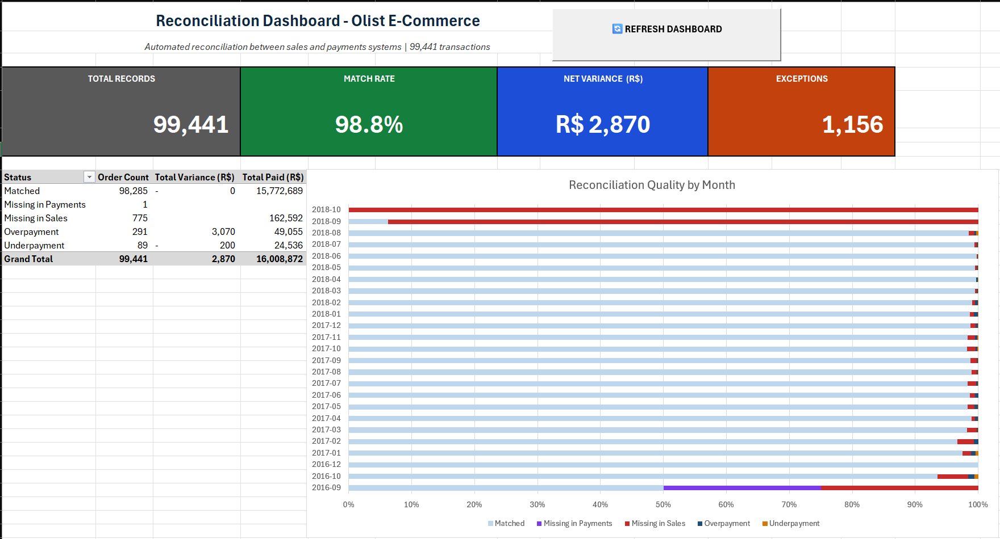
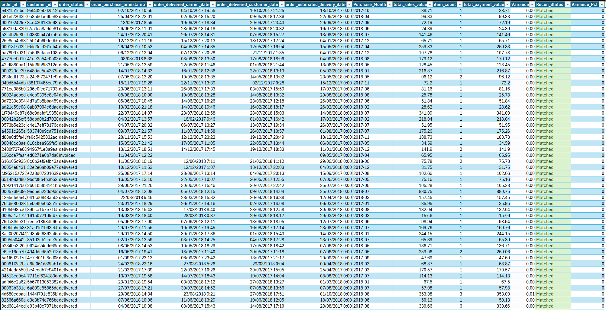
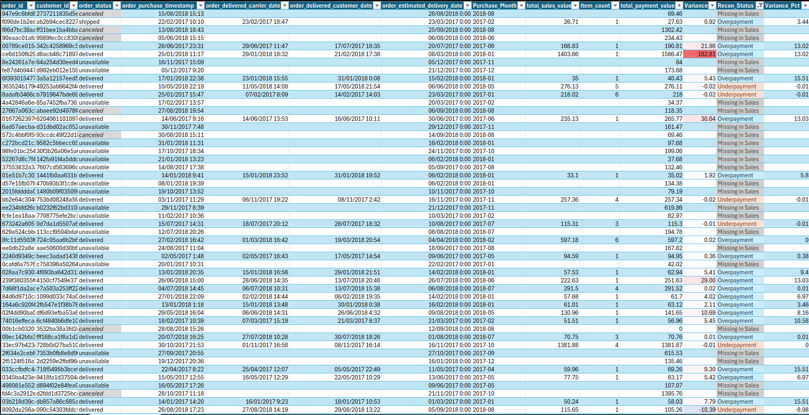
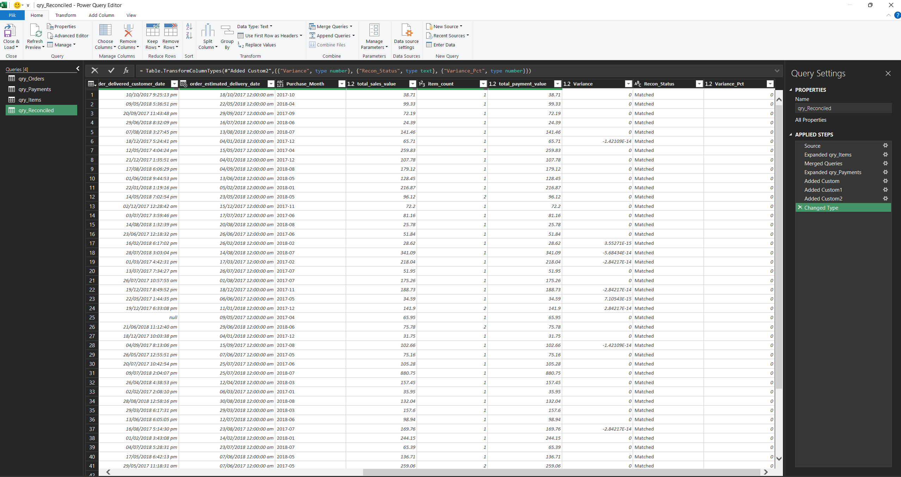

# Automated Reconciliation & Reporting Pipeline

  

An Excel-based ETL pipeline that reconciles transaction data between two source systems, classifies discrepancies, and produces an auditable summary dashboard. Built using Power Query for data transformation and VBA for one-click automation.

Tested on the **Olist Brazilian E-Commerce** dataset — 99,441 real transactions from 2016 to 2018 modeling a sales-vs-payments reconciliation scenario.



## The Problem

In any organization with separate sales and payment systems, transaction data must be reconciled periodically — typically a multi-day manual process involving CSV exports, VLOOKUPs, and spot-checking. This project automates the entire workflow into a one-click refresh.

## Architecture

The pipeline consists of three layers:

**1. Data Ingestion (Power Query)**
- Loads source CSV files as separate queries (`qry_Orders`, `qry_Items`, `qry_Payments`)
- Sets data types and standardizes keys
- Aggregates payments per order_id (Group By + Sum) to collapse installment plans into single records

**2. Reconciliation Logic (Power Query)**
- Left Outer Join across sources on order_id
- Custom column logic classifies each transaction:
  - `Matched` — values agree within 0.01 tolerance
  - `Overpayment` — payment exceeds sale value
  - `Underpayment` — payment below sale value
  - `Missing in Sales` — payment exists, no order record
  - `Missing in Payments` — order exists, no payment record

**3. Reporting & Automation (Excel + VBA)**
- KPI dashboard with pivot tables and 100% stacked bar chart
- Conditional formatting on Recon_Status for visual exception scanning
- One-click VBA macro refreshes all queries, pivots, and audit log
- Audit_Log sheet captures every execution with timestamp, user, and record count

## Visual Output Examples

The conditional formatting layer makes exception scanning instant. The two views below show the same data filtered differently — left shows clean matched transactions (the 98.8% majority), right shows only flagged anomalies requiring review.

| Matched Transactions (clean data) | Filtered Exceptions (anomalies) |
|---|---|
|  |  |

## Key Findings

| Metric | Value |
|---|---|
| Total transactions reconciled | 99,441 |
| Match rate | 98.8% |
| Total exceptions flagged | 1,156 |
| Largest discrepancy category | Missing in Sales (775 records, R$ 162,591) |
| Overpayment-to-underpayment ratio | 3:1 |
| Net variance | R$ 2,870.39 |

The 3:1 overpayment ratio strongly suggests installment processing fees as the root cause rather than data quality issues — a hypothesis testable by drilling down on `payment_installments_max`.

## Technical Highlights

- **Floating-point-safe matching:** uses `Number.Abs(variance) < 0.01` instead of strict equality to ignore binary arithmetic artifacts (values like `1.42e-14` would otherwise be flagged as discrepancies)
- **Aggregate-before-merge pattern:** prevents row multiplication when one order has multiple payment rows due to installment plans
- **Async-aware refresh:** VBA macro waits for Power Query to complete before triggering downstream pivot updates
- **Self-documenting audit trail:** every execution writes timestamped row to Audit_Log with Windows username and processed record count



## How to Run

### 📥 Download the workbook

The Excel workbook (32 MB) is hosted on Google Drive due to GitHub's 25 MB file size limit:

**[Download Olist_Reconciliation.xlsm](https://drive.google.com/file/d/1BwbHfl3FxCPSanE6N5IN78XdWWK1VB4H/view?usp=sharing)**

### Setup steps

1. Download the dataset from [Kaggle — Olist Brazilian E-Commerce](https://www.kaggle.com/datasets/olistbr/brazilian-ecommerce)
2. Place the required CSV files in the same folder as `Olist_Reconciliation.xlsm`:
   - `olist_orders_dataset.csv`
   - `olist_order_items_dataset.csv`
   - `olist_order_payments_dataset.csv`
3. Open the workbook and enable macros (you'll see a yellow warning bar — click "Enable Content")
4. Click **Refresh Dashboard** on the Dashboard sheet

⚠️ **Note:** You must have Microsoft Excel 2016 or newer with Power Query support. Excel Online and macOS versions may have limited functionality.

## Repository Structure

```
olist-reconciliation-pipeline/
├── README.md                  ← project overview (this file)
├── vba/
│   └── OneClickRefresh.bas         ← exported VBA module (readable on GitHub)
└── screenshots/
    ├── dashboard.png                       ← KPI dashboard overview
    ├── reconciled-output-matched.png       ← normal matched transactions view
    ├── reconciled-output-exceptions.png    ← filtered view of flagged anomalies
    └── power-query-editor.png              ← Power Query transformation pipeline

Workbook hosted externally on Google Drive (see Download section above).
## Skills Demonstrated

Excel · Power Query · M language · VBA · PivotTables · Conditional Formatting · ETL pipeline design · Data reconciliation · Audit & compliance design