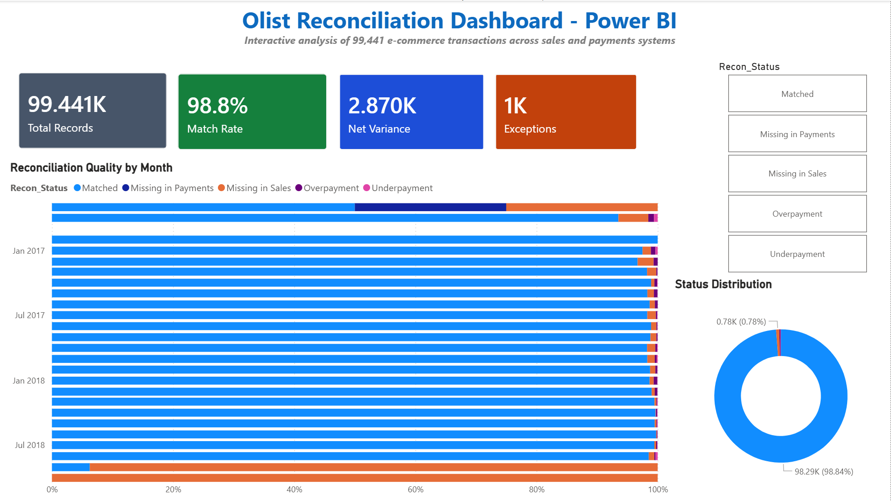

# Olist Reconciliation Pipeline

A small project I built to learn Power Query, VBA, and Power BI on real data — the Olist Brazilian e-commerce dataset from Kaggle (about 100k transactions from 2016-2018).

The idea: take two sources of transaction data (orders and payments) and find where they don't match. This is the kind of work a finance analyst does manually every month — pulling exports, running VLOOKUPs, chasing discrepancies. I wanted to see how far I could automate it.

## What it does

The pipeline reads three CSV files from Olist, joins them on order_id, and flags every transaction as one of:

- **Matched** — payment equals expected value (within 1 cent tolerance)
- **Overpayment** — customer paid more than the order value
- **Underpayment** — customer paid less
- **Missing in Sales** — payment exists but no order record
- **Missing in Payments** — order exists but no payment record

Out of 99,441 transactions, 98.8% match cleanly. The other 1,156 get flagged and grouped by type.

## What I learned building this

The 0.01 tolerance threshold matters more than I expected. Without it, thousands of rows get flagged as discrepancies because of floating-point rounding errors — I was seeing values like `1.42e-14` showing up as "variance". Spent a while confused why my matched count was off before figuring this out.

The other tricky bit was payments having multiple rows per order. If a customer pays in 10 installments, that's 10 rows in the payments file. First attempt I just merged the tables and got totals 5x too high. Took me a moment to realize I had to aggregate first, then merge.

The 3:1 ratio of overpayments to underpayments was an interesting finding — most likely caused by installment fees (Brazilian "parcelado" payments add interest), not actual data errors. That's the kind of thing I'd dig into more if this were a real job.

## The Excel version

Dashboard with KPI cards, a monthly trend chart, and conditional formatting on the exceptions sheet so you can scan and spot anomalies fast. There's a "Refresh" button wired to a VBA macro — it re-pulls the CSVs, recalculates everything, refreshes the pivots, and logs the run with timestamp and username. Basically what I'd want if I had to do this every month at work.

## The Power BI version

I rebuilt the same dashboard in Power BI to compare the two tools. The Power Query M code from Excel pastes into Power BI 1:1, which was nice to discover — same engine, different host application.

What Power BI adds: clicking any status in the slicer filters the whole report instantly. In Excel I had to manually filter pivot tables. Also wrote a few DAX measures for the KPI cards (Match Rate, Net Variance, Exceptions count).

## Files

- `powerbi/olist_reconciliation_powerbi_dashboard.pbix` — Power BI version
- `vba/OneClickRefresh.bas` — the refresh macro, readable here without downloading
- `screenshots/` — what the dashboards look like

The Excel workbook (32 MB) is hosted on Google Drive due to GitHub's 25 MB file size limit:

**[📥 Download Olist_Reconciliation.xlsm](https://drive.google.com/file/d/1BwbHfl3FxCPSanE6N5IN78XdWWK1VB4H/view?usp=sharing)**

## How to run it yourself

1. Get the Olist dataset from [Kaggle](https://www.kaggle.com/datasets/olistbr/brazilian-ecommerce)
2. Put the three CSVs (orders, order_items, order_payments) in the same folder as the Excel file
3. Open the workbook, enable macros, click **Refresh Dashboard**

For the Power BI version, just open the .pbix file — you'll need to point Power Query to your local CSV paths the first time.

## Tools

Excel, Power Query (M), VBA, Power BI, DAX
